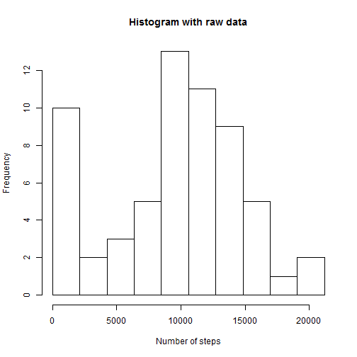
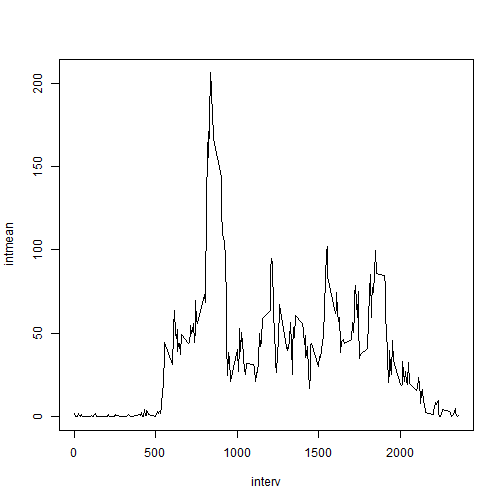
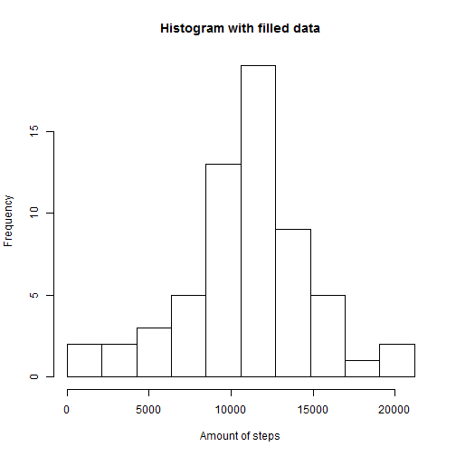
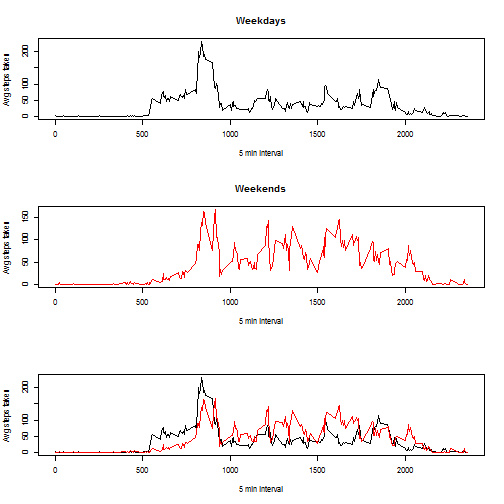

##Loading and preprocessing the data


```r
dat<-read.csv("C:/Users/anbren2/Documents/Data_Science/05 Reproducible research/activity.csv")
head(dat)
```

```
##   steps       date interval
## 1    NA 2012-10-01        0
## 2    NA 2012-10-01        5
## 3    NA 2012-10-01       10
## 4    NA 2012-10-01       15
## 5    NA 2012-10-01       20
## 6    NA 2012-10-01       25
```
##Mean total number of steps taken per day


```r
daytotal <- 1:(nrow(dat)/288)
for (i in 1:length(daytotal)){
  x <- (i-1)*288+1
  y <- 288*i
  daytotal[i] <- sum(dat$steps[x:y],na.rm = T)
}

daytotal
```

```
##  [1]     0   126 11352 12116 13294 15420 11015     0 12811  9900 10304
## [12] 17382 12426 15098 10139 15084 13452 10056 11829 10395  8821 13460
## [23]  8918  8355  2492  6778 10119 11458  5018  9819 15414     0 10600
## [34] 10571     0 10439  8334 12883  3219     0     0 12608 10765  7336
## [45]     0    41  5441 14339 15110  8841  4472 12787 20427 21194 14478
## [56] 11834 11162 13646 10183  7047     0
```

```r
hist(daytotal,breaks = seq(from = 0, to = max(daytotal,na.rm = T), by = max(daytotal,na.rm = T)/10 ), xlab = "Number of steps", main = "Histogram with raw data")
```

 

```r
meandt <- mean(daytotal,na.rm = T)
meandt  <- round(meandt, digits = 2)
mediandt <- median(daytotal,na.rm = T)
```
The mean of the total number of steps taken per day is 9354.23 and the median is 10395

##Average daily activity pattern


```r
interv <- dat$interval[1:288]
intmean <- NULL
intsum <- NULL
for (i in 1:288){
  intmean[i]<-mean(dat$steps[dat$interval==interv[i]],na.rm=T)
  }
plot(interv,intmean,type = "l")
```

 

```r
maxsteps<-interv[intmean == max(intmean)]
```

The interval which, on average, contains the maximum number of steps is 835


#Imputing missing values


```r
qna <- sum(is.na(dat$steps))
```


The total number of missing values in the dataset is 2304


```r
#Missing values will be filled with the mean for the corresponding 5-min interval
meancomp <- rep(intmean, times = 61)
datcomp <- dat
datcomp$steps[is.na(datcomp$steps)]<-meancomp[is.na(datcomp$steps)]

daytotal <- 1:(nrow(dat)/288)
for (i in 1:length(daytotal)){
  x <- (i-1)*288+1
  y <- 288*i
  daytotal[i] <- sum(datcomp$steps[x:y])
}
daytotal
```

```
##  [1] 10766.19   126.00 11352.00 12116.00 13294.00 15420.00 11015.00
##  [8] 10766.19 12811.00  9900.00 10304.00 17382.00 12426.00 15098.00
## [15] 10139.00 15084.00 13452.00 10056.00 11829.00 10395.00  8821.00
## [22] 13460.00  8918.00  8355.00  2492.00  6778.00 10119.00 11458.00
## [29]  5018.00  9819.00 15414.00 10766.19 10600.00 10571.00 10766.19
## [36] 10439.00  8334.00 12883.00  3219.00 10766.19 10766.19 12608.00
## [43] 10765.00  7336.00 10766.19    41.00  5441.00 14339.00 15110.00
## [50]  8841.00  4472.00 12787.00 20427.00 21194.00 14478.00 11834.00
## [57] 11162.00 13646.00 10183.00  7047.00 10766.19
```

```r
hist(daytotal,breaks = seq(from = 0, to = max(daytotal), by = max(daytotal)/10 ), xlab = "Amount of steps", main = "Histogram with filled data")
```

 

```r
meandt <- mean(daytotal)
meandt  <- round(meandt, digits = 0)
mediandt <- median(daytotal)
mediandt  <- round(mediandt, digits = 0)
```
The mean of the total number of steps taken per day, after filling the missing values is 1.0766 &times; 10<sup>4</sup> and the median is 1.0766 &times; 10<sup>4</sup>.

The mean value has been increased considerably due to in the first case, days without data are considered to have 0 steps (that is possible to see in the first histogram), and now these days have 10766.19 steps. Besides, the median was also increased for the same reason.  

##Differences in activity patterns between weekdays and weekends


```r
library(timeDate)
wdays <- isWeekday(as.POSIXct(dat$date))
datcomp <- data.frame(datcomp, day = wdays)
datcomp$day[datcomp$day==T] <- "Weekday"
datcomp$day[datcomp$day==F] <- "Weekend"
head(datcomp)
```

```
##       steps       date interval     day
## 1 1.7169811 2012-10-01        0 Weekday
## 2 0.3396226 2012-10-01        5 Weekday
## 3 0.1320755 2012-10-01       10 Weekday
## 4 0.1509434 2012-10-01       15 Weekday
## 5 0.0754717 2012-10-01       20 Weekday
## 6 2.0943396 2012-10-01       25 Weekday
```

```r
intmeanwd <- NULL
intmeanwe <- NULL

for (i in 1:288){
intmeanwd[i]<-mean(datcomp$steps[datcomp$interval==interv[i]& datcomp$day == "Weekday" ],na.rm=T)
intmeanwe[i]<-mean(datcomp$steps[datcomp$interval==interv[i]& datcomp$day == "Weekend" ],na.rm=T)
}

par(mfrow=c(3,1))
plot(interv,intmeanwd,type="l", main = "Weekdays", xlab = "5 min interval", ylab = "Avg steps taken")
plot(interv,intmeanwe,type="l",col = "red", main = "Weekends",xlab = "5 min interval", ylab = "Avg steps taken")
plot(interv,intmeanwd,type="l",xlab = "5 min interval", ylab = "Avg steps taken")
lines(interv,intmeanwe, col="red")
```

 

